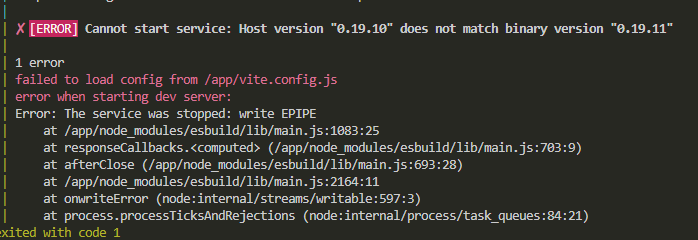

## Manga App — Le Collectif

This manga app lets you add manga to your list, favorite them and label them as read. You can use the genre filter to see which manga belong to which genre. You can also use the Read & Favourite filter to see which manga have been read or favorited.

A separate input form lets you add a new manga to the list by providing a title, an author, an image link to a cover and the number of volumes. After the manga has been created, you can also attribute up to three genres to this newly created entry in your reading list.
## Demo

 - [Video demo](https://youtu.be/0jSmWg1N4jk)

## Installation

Git clone this project

```bash
  git clone https://github.com/EHB-MCT/portfolio-starter-JoachimHamraoui.git

```
    
Install dependencies in API & Front-End

```bash
  cd images/api
  npm install

  cd ..
  cd frontend
  npm install
```

Create .env file with credentials to PostgreSQL database in root folder

```bash
  # Add this to .env file and add credentials
  PORT=

  POSTGRES_PASSWORD=
  POSTGRES_USER=
  POSTGRES_DB=
  POSTGRES_PORT=
  NODE_ENV=
```

Start Docker containers & images (in root folder)

```bash
  docker-compose up --build
```

Open a new tab in terminal
Navigate to frontend folder in images and start React project
```bash
   cd ./images/frontend
   npm run dev
```
## Errors

The Frontend service has been commented out in the docker-compose.yml file for a specific reason.

This is why I am starting the frontend project separately from the docker containers.




## Documentation

[ChatGPT — Get All Manga by Genre](https://chat.openai.com/c/12d8bfd9-ad2e-4520-9d75-734ede674729)

[Importing Routes in Server](https://www.npmjs.com/package/typewriter-effect)

[Importing Routes in Server](https://www.npmjs.com/package/typewriter-effect)

## 🔗 Links
[](http://www.joachimhamraoui.com)
[](https://www.linkedin.com/in/joachim-hamraoui-6950b6173/)

